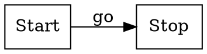
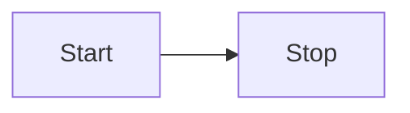
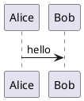

# Diagrams

Three active diagram languages. All three must parse and render, not fall back to source.

```dot
digraph G {
  rankdir=LR
  a [label="Start" shape=box]
  b [label="Stop" shape=box]
  a -> b [label="go"]
}
```

```mermaid
flowchart LR
  A[Start] --> B[Stop]
```

```plantuml
@startuml
Alice -> Bob: hello
@enduml
```
