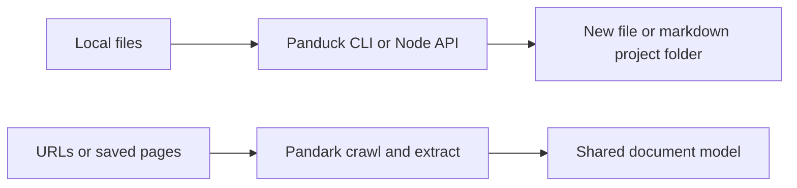

# Panduck

[](https://www.npmjs.com/package/@notedge/panduck) [](https://www.mozilla.org/MPL/2.0/) [](https://nodejs.org/) [](https://github.com/notedge/panduck)

## 💡 What is Panduck?

You have a Word file, an EPUB, or a pile of Markdown notes. Panduck converts it to another format and tells you honestly what survived—headings, links, images, footnotes, tables—and what did not.

It is not “Save As” with marketing copy. Complex layouts often come out partial. Panduck writes `panduck.report/v1` JSON so you can read the losses before you ship the result.

You can also get a **Markdown project** folder: `index.md` or `chapters/*.md`, images under `assets/`, and `panduck.report.json` next to them—something you can commit and browse on GitHub.

Panduck only works on **files you already have**. [Pandark](https://github.com/notedge/pandark) fetches web pages into the same document model; install it separately when you need crawling.

## 🚀 Getting started

### 1. Agent / prompt (recommended)

`@notedge/panduck-skills` gives your coding agent instructions. It does not install Panduck.

```bash
npm install -g @notedge/panduck-skills
panduck-skills -y
```

```text
Use Panduck to check whether ./draft.docx can convert to Markdown.
If the route exists, write ./draft.md and ./draft.report.json without touching the source.
Summarize any semantic losses from the report.
```

Full skill: [`projects/packages/panduck-skills/skills/panduck/SKILL.md`](projects/packages/panduck-skills/skills/panduck/SKILL.md).

### 2. Command line (global install)

Node 20+. Install once, then use `panduck` anywhere:

```bash
npm install -g @notedge/panduck
panduck doctor
```

See what your install supports:

```bash
panduck formats --json
```

Check one file before you convert a whole directory:

```bash
panduck plan ./paper.docx --to markdown
```

Convert without touching the original:

```bash
panduck convert ./paper.docx --to markdown -o ./paper.md --report ./paper.report.json
```

Whole project with images materialized:

```bash
panduck convert ./paper.docx --to markdown-project -o ./paper-md
```

Other useful commands: `check` (validate only), `inspect` (peek inside a DOCX package). One-off: `npx @notedge/panduck convert …`.

## ✨ Highlights

- Reports losses instead of hiding them
- `plan` before batch jobs so you do not promise a format that fails
- Will not overwrite output unless you pass `--overwrite`
- Markdown projects from Word, EPUB, PDF, HTML, legacy `.doc`, and more
- Same conversions from shell or from Node (`loadPanduckNode()`)

## 📊 What works today

| You have | You want |
|----------|----------|
| Word (`.docx`) | Markdown |
| Word (`.docx`) | Word (rewritten) |
| Markdown | Markdown / Word |
| Notedown | Markdown |
| EPUB | Markdown |

Markdown **project** folders (`--to markdown-project`): Word, `.doc`, PDF, EPUB, HTML, Markdown, Notedown.

`formats` may show extra names (Org, TeX, HTML, PDF). Treat them as hints—run `plan` on a real file before automating.

Browser WASM build lists formats only; converting files on disk needs Node.



## 📊 Reports

Every real conversion can produce `panduck.report/v1` JSON (`--report`, stdout, or the API).

- **status** — finished clean, finished with losses, or blocked
- **losses** — footnotes, images, styles, and other semantics that dropped
- **outputs** — paths Panduck actually wrote

Read the report even when the command exits 0. Use `--strict` if you want losses to count as failure.

## 🧪 Node API

```ts
import { loadPanduckNode } from "@notedge/panduck/node";

const panduck = loadPanduckNode();
const result = panduck.convertDocument!("docx", "markdown", "./paper.docx");
console.log(result.reportJson);
```

CLI details and npm exports: [`projects/packages/panduck/readme.md`](projects/packages/panduck/readme.md).

## 🔧 When something fails

| You see | What to do |
|---------|------------|
| `Unsupported platform for Panduck native bindings` | Reinstall on a supported OS/CPU; do not use `npm install --omit=optional` |
| `conversion pipeline is not wired yet` | That conversion is not built yet—try `plan` on your file |
| `legacy .doc import requires OLE reader` | Save as `.docx`, or try `--to markdown-project` if your version supports `.doc` |
| Output looks wrong but exit code is 0 | Read `losses` in the report |
| `markdown-project requires an output directory` | `-o` must be a folder, not a `.md` file |

## 📜 License

MPL-2.0
