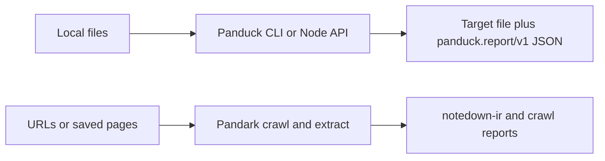

# Panduck

Panduck converts documents you already have on disk—Word, Markdown, EPUB, Notedown, and related containers—into another supported format while reporting what was preserved, inferred, or lost. Install `@notedge/panduck` on Node 20 or newer when you need a scriptable conversion with a machine-readable report.

This release is honest about partial fidelity: tables, footnotes, custom styles, and embedded assets may survive, flatten, or disappear. Treat every batch job as something to verify with `panduck plan` or a single-file `--report` before you overwrite sources.

## 🤖 Use with an agent

`@notedge/panduck-skills` installs **agent instructions only**. It does not install the Rust engine, platform binaries, or missing conversion routes.

```bash
npx @notedge/panduck-skills
npx @notedge/panduck-skills -a cursor -y
```

```text
Use Panduck to check whether ./draft.docx can convert to Markdown.
If the route exists, write ./draft.md and ./draft.report.json without touching the source.
Summarize any semantic losses from the report.
```

Full agent workflow: [`projects/packages/panduck-skills/skills/panduck/SKILL.md`](projects/packages/panduck-skills/skills/panduck/SKILL.md).

## 📦 Install and run one conversion

```bash
npm install @notedge/panduck
npx panduck doctor
npx panduck formats --json
```

Pick a verified route, then convert to a **new** output path:

```bash
npx panduck convert ./paper.docx --to markdown -o ./paper.md --report ./paper.report.json
```

Inspect a DOCX package without reading body semantics:

```bash
npx panduck inspect ./paper.docx --stage index --json
```

Node API (same engine as the CLI):

```ts
import { loadPanduckNode } from "@notedge/panduck/node";

const panduck = loadPanduckNode();
console.log(panduck.supportedConversions?.());
const result = panduck.convertDocument!("docx", "markdown", "./paper.docx");
console.log(result.reportJson);
```

Optional platform packages (`@notedge/panduck-win32-x64`, `@notedge/panduck-darwin-arm64`, and siblings) install automatically when npm supports your OS and CPU.

## ✅ What works today

These **conversion routes** are wired in the native binding and CLI pipeline when `supportsConversion(from, to)` returns true:

| From | To | Typical use |
|------|-----|-------------|
| `docx` | `markdown` | Word notes → Markdown |
| `docx` | `docx` | Normalized rewrite inside OPC |
| `markdown` | `markdown` | Normalize Markdown |
| `markdown` | `docx` | Markdown → Word |
| `notedown` | `markdown` | Notedown → Markdown |
| `epub` | `markdown` | EPUB → Markdown |

`panduck formats` and `supportedFormats()` list additional registered names (Org, RST, TeX, HTML, PDF, legacy `.doc`). Registration does **not** mean every read/write direction works. Run `panduck plan INPUT --to TARGET` or `supportsConversion` before promising a job.

**WASM (`@notedge/panduck/wasm`)** exposes version and format discovery only in this release—no `convertDocument` on the binding surface.

**Not available yet:** HTML/PDF/Org/RST/TeX writers through the CLI pipeline, legacy `.doc` import, and lossless guarantees for complex Word or EPUB layouts.



Pandark collects or extracts web pages; Panduck converts files you already have. They complement each other but do not share the same install task.

## 📊 Reports, assets, and partial success

Successful runs emit `panduck.report/v1` JSON (stdout, `--report`, or `reportJson` from the API). Read:

- `status` — `success`, `success_with_loss`, or `blocked`
- `coverage` / `losses` — semantic constructs that were dropped or inferred
- `diagnostics` — adapter and orchestration messages
- `outputs` — paths actually written

Use `--strict` or inspect `loss_count` before treating output as publication-ready. The CLI refuses to overwrite an existing output unless you pass `--overwrite`.

## 🔧 When something fails

| Symptom | What to check |
|---------|----------------|
| `Unsupported platform for Panduck native bindings` | Install on a supported OS/CPU or use a machine with an optional platform package |
| `conversion pipeline is not wired yet` | Route not implemented—run `panduck formats --json` and `supportsConversion` |
| `legacy .doc import requires OLE reader` | Convert the file to `.docx` first |
| Empty or surprising Markdown from Word | Open the report losses; complex tables and footnotes are often partial |
| WASM load works but no convert API | Use Node for file conversion—the WASM binding exposes format discovery only |

## 🛠 Develop and contribute

From a clone of https://github.com/notedge/panduck:

```bash
pnpm install
pnpm run build:napi
pnpm run build:wasm
cargo test --release
pnpm typecheck
```

License: MPL-2.0
